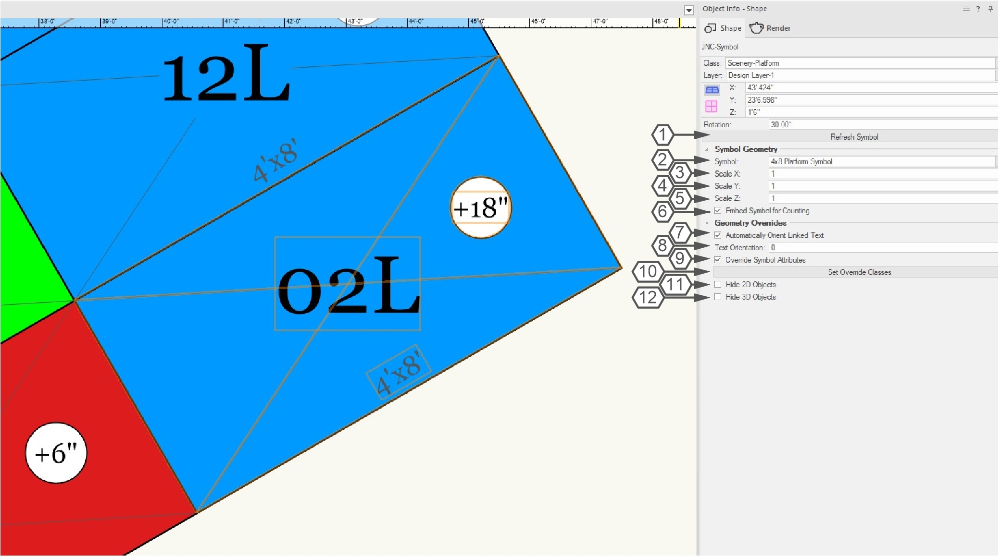
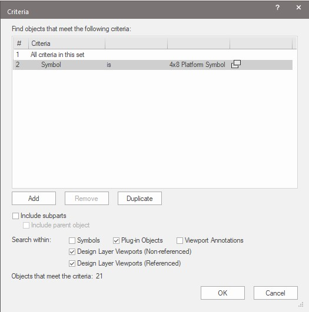
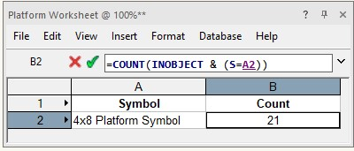
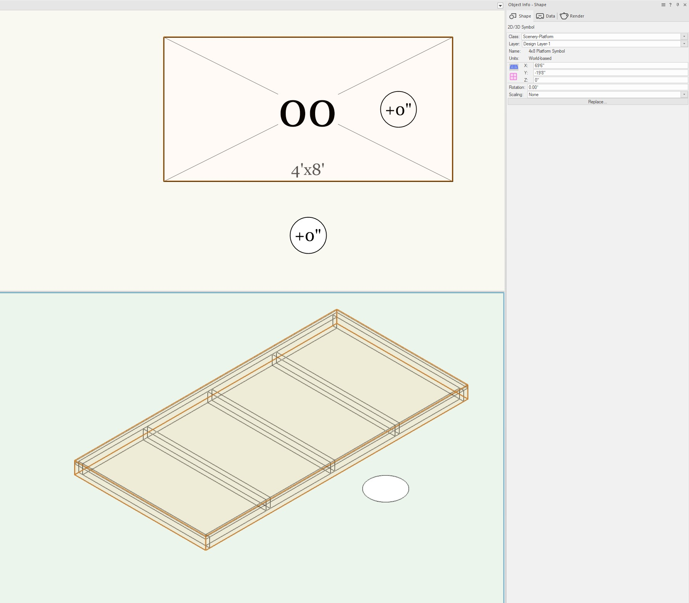
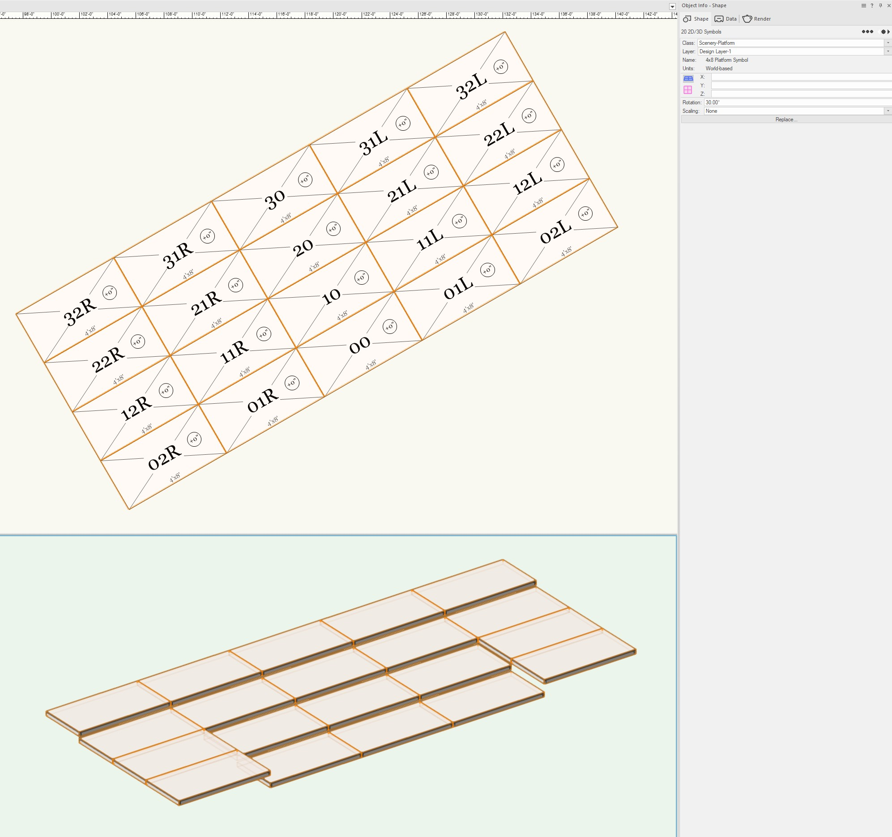
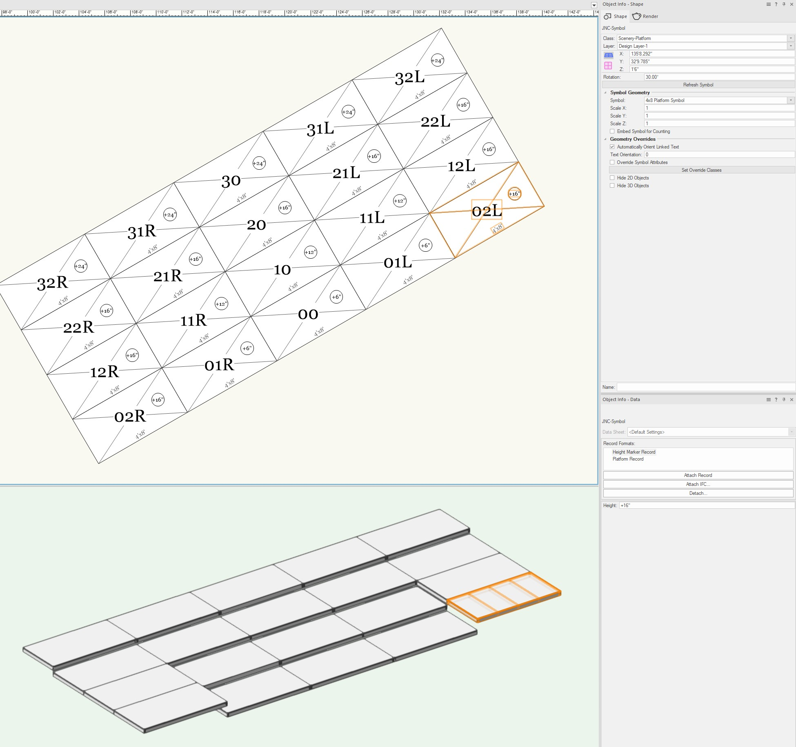
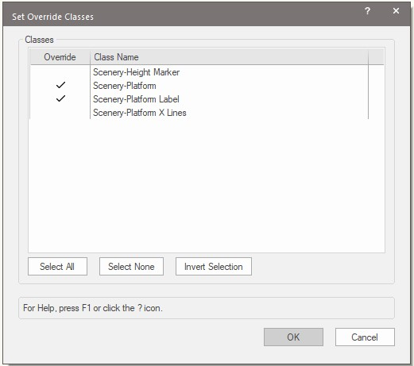
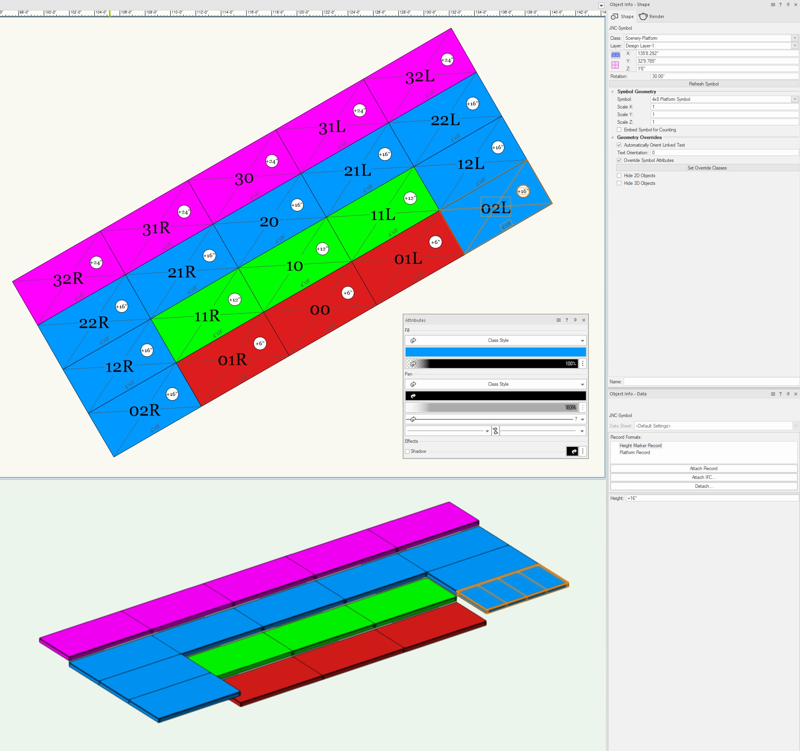

# JNC-Symbol

Plug-in Object

## Icon

## Version

**1.0.2** - 6/2/2025

This plug-in is written in Vectorscript (Pascal) and can be used in any version of [Vectorworks](https://www.vectorworks.net) 2019 or newer.

## Table of Contents

(click to open)

1. [Description](#description)
1. [Instructions](#instructions)
1. [Object Info Parameters](#object-info-palette-parameters)
1. [Supplemental commands](#supplemental-commands)
    1. [Convert to JNC-Symbol](#convert-to-jnc-symbol)
    1. [Refresh All JNC-Symbols](#refresh-all-jnc-symbols)
1. [Worksheet Symbol Counting Example](#working-with-workheet-symbol-counting)
1. [Overriding Symbol Attributes Example](#overriding-symbol-attributes-example)
1. [Tips and Tricks](#tips-and-tricks)
1. [Installation Instructions](#installation-instructions)
    1. [Direct Download](#direct-download)
    1. [JNC Tools Free Manager](#jnc-tools-free-manager)
1. [Adding the Plug-ins to your Workspace](#adding-the-plug-in-to-your-workspace)
1. [Localization Instructions](#localization-instructions)
1. [Release Notes](#release-notes)
1. [Known Bugs](#known-bugs)
1. [Feature Requests](#feature-requests)
1. [License](#license)

## Description

The plug-in object allows the user to create an "enhanced" Symbol object using an existing Symbol from the drawing by copying the geometry of the Symbol into a Plug-in Object (PIO).

Enhancements include:

- Ability to override visual Attributes such as fill and pen color and style and lineweight on a Class by Class basis.
- Automatically rotate internal Text linked to a Record Format to be right-reading.
- Ability to easily access and modify Record information attached to Symbols within main Symbol.
- Ability to hide either the 2D or 3D components in Hybrid Symbols.
- Ability to embed a scaled down version of original Symbol for accurate Worksheet counting.
- Selection Bounding Box will be tight to objects rather than rectangular.

## Instructions

A **JNC-Symbol** object can be created using two different methods:

### 1. Direct PIO Placement
1. Activate the **JNC-Symbol** tool.
1. Place the **JNC-Symbol** object in the desired location. This will be initially be a **2D Locus** object.
1. Open the **Symbol** drop-down menu in the **Object Info Palette** (OIP) and choose a Symbol.
1. Enter scale factors in the **Scale X**, **Scale Y**, and **Scale Z** fields in the OIP.
1. Check the **Embed Symbol for Counting** to allow the original Symbol to be counted in Worksheets.
1. Check the **Automatically Orient Linked Text** box to orient any **Text** objects within the symbol that have been linked to a **Record Format** using the **Link Text to Record** menu command. Enter any additional rotation amount into the **Text Orientation** field.
1. Check the **Override Symbol Attributes** box to use Plug-in Object's Attributes rather than the Symbol definition's.
1. Press the **Set Override Classes** button in the OIP to set which Classes will be affected by the **Override Symbol Attributes** option. All Classes will be affected by default.
1. For Hybrid Symbols, choose whether to hide the 2D or 3D components by checking the **Hide 2D Objects** or **Hide 3D Objects** boxes.

### 2. Using the *Convert to JNC-Symbol* Command
1. Select existing Symbol objects wanting to be converted to **JNC-Symbol** objects.
1. Run the **Convert to JNC-Symbol** menu command.
1. All selected Symbols will be replaced with **JNC-Symbol** objects with matching Class, scaling, and location.

## Object Info Palette Parameters

1. **Refresh Symbol** Button: Press this button to refresh all currently selected **JNC-Symbol** objects. This may be necessary after editing the referenced Symbol.
1. **Symbol**: Choose a Symbol from the drop-down list. Selecting **None** will result in the **JNC-Symbol** PIO displaying as a **2D Locus** object. The drop-down will automatically populate with all Symbol Definitions in the drawing and will update as Symbols are added or removed.
1. **Scale X**: Enter the scale factor for the X Axis. Enter **1** to retain original size.
1. **Scale Y**: Enter the scale factor for the Y Axis.
1. **Scale Z**: Enter the scale factor for the Z Axis. This will only appear in if the chosen Symbol contains 3D geometry.
1. **Embed Symbol for Counting**: Check this box to embed a copy of the chosen Symbol into the plug-in object in order to count the Symbol in Worksheets. This option will be ignored if either the **Hide 2D Objects** or **Hide 3D Objects** boxes are checked.
1. **Automatically Orient Linked Text**: Check this box to cause all Text in the Symbol currently linked to a Record Format using the **Link Text to Record** menu command to rotate to be parallel with the X Axis.
1. **Text Orientation**: Enter the value of any additional rotation needed for linked Text when **Automatically Orient Linked Text** is checked.
1. **Override Symbol Attributes**: Check this box to override the Symbol definition's visual attributes with the **JNC-Symbol**'s attributes.
1. **Set Override Classes** Button: Press this button to open a dialog box to choose which Classes will be affected by the **Override Symbol Attributes** checkbox. By default, all Classes will be affected.
1. **Hide 2D Objects**: Check this box to hide all geometry in the 2D component of the chosen Symbol. This option only appears if the chosen Symbol is a Hybrid Symbol.
1. **Hide 3D Objects**: Check this box to hide all geometry in the 3D component of the chosen Symbol. This option only appears if the chosen Symbol is a Hybrid Symbol.

## Supplemental Commands

### Convert to JNC-Symbol

Running the **Convert to JNC-Symbol** command will convert any visible and selected Symbol object into a **JNC-Symbol** object with the same location, rotation, Class, and attached Record data.

The command will fail unless at least one Symbol object is selected.

> [!CAUTION]
> Due to some difficulties with the mirror Vectorscript commands, internal Symbols that have been mirrored *will not* appear in the correct orientation. Please edit the Symbol and make sure the Symbols are not mirrored.

### Refresh All JNC-Symbols

If a Symbol that a **JNC-Symbol** is referencing is changed, the **JNC-Symbol** object will need to be refreshed. Running the **Refresh All JNC-Symbols** menu command will force all **JNC-Symbol** objects to refresh and take on the most current Symbol geometry.

It is recommended to run this command before publishing or exporting any sheets to make sure that all **JNC-Symbols** are up to date.

## Worksheet Symbol Counting Example

If the **Embed Symbol for Counting** option is checked, a copy of the original Symbol will be scaled down and embedded at the Insertion Point of the **JNC-Symbol** object. This allows the Symbol to be counted when the **Plug-in Objects** box under the **Search Within** section of the **Criteria** dialog box is checked or when **INOBJECT** is included in the Worksheet criteria.

> [!NOTE]
> If either **Hide 2D** or **Hide 3D** is checked, the **Embed Symbol** option will be ignored and the Symbol will not be counted.

> [!CAUTION]
> Some geometry, such as **Wall** objects and **Roof** objects, do not scale properly. If you are unable to **Override Symbol Attributes** or if it appears that the original Symbol is blocking the **JNC-Symbol** object, try unchecking the **Embed Symbol for Counting** box.

## Overriding Symbol Attributes Example

Let us consider a practical example.  Let's say that we have a Symbol depicting a standard 4'x8' theatre platform that we want to use to produce a platform layout for a scenic design.  The Symbol is a Hybrid Symbol, with the framing drafted out in 3D and a simple 2D representation with a rectangle (in Class **Scenery-Platform**) and some "cross lines" (in Class **Scenery-Platform X Lines**). We want to be able to give each platform a label, so a Text object has been added (in Class **Scenery-Platform Label**) and linked to a Record Format called **Platform Record**.

These platforms are also going to be at different heights, so we've made a second symbol, a generic 2D **Height Marker Symbol** that also its text linked to a Record Format called **Height Marker Record**. This Symbol has been included inside the **4x8 Platform Symbol**.

These platforms are going to be used to make up a larger platform system, one that is at a 30degree angle.

We've used the **Data** tab of the **Object Info Palette** to assign the labels, but we aren't able to get to the Height Marker record to assign heights, and the labels are also at the 30degree angle.

Let's also say that it is desirable to color-code the platforms based on the height, just to make it extra clear which platforms are at which height.

If we convert these Symbols into **JNC-Symbols** using the **Convert to JNC-Symbols** menu command, we are now able to re-orient the label and height text to be "right-reading", and we now have access to the embedded **Height Marker Record**.

Now let's say we want to color-code the platforms, just to make it extra clear which ones are at which height. We can use the **Override Symbol Attributes** checkbox in the **Object Info Palette** to override the fill color.

We don't want to affect the Height Marker, and also don't want to override the settings on the "cross lines", so we press the **Set Override Classes** button and make sure that only the **Scenery-Platform** and **Scenery-Platform Label** Classes will be affected.

Now we can easily color-code the **JNC-Symbol** objects.

If an object has its fill type set to **None**, the override *will not* affect the fill type, it will remain set to **None**.

## Tips and Tricks

- Consider the use of setting Attributes "By Class" when using the **Override Symbol Attributes** option. In the example above, we could have made a class for each height and placed the **JNC-Symbol** objects accordingly with their Fill Color to be "By Class". That way we could change the colors of each level on a Viewport-to-Viewport basis.
- Double-clicking a **JNC-Symbol** object will take you directly into the referenced Symbol's Edit mode. The component will be dependent on what type of Symbol the reference is (2D, 3D, or Hybrid), and what the current projection is. In **Top/Plan** view, the 2D Component will be edited. In a 3D view, the 3D Component will be edited. Please note that the **Component Edit** widget will not appear when editing this way.

## Installation Instructions

There are two methods of installation, direct download of the plug-in or through the **JNC Tools Free Manager** plug-in.

### Direct Download:

1. Download source plug-in files:
    1. [JNC-Symbol](JNC-Symbol.vso) plug-in object
    1. [Convert to JNC-Symbol](Convert%20to%20JNC-Symbol.vsm) menu command
    1. [Refresh All JNC-Symbols](Refresh%20All%20JNC-Symbols.vsm) menu command
1. Place downloaded files inside the **Vectorworks User Folder** within the **Plug-ins** directory
1. Restart Vectorworks

### JNC Tools Free Manager

1. Run the [**JNC Tools Free Manager**](https://jncogs.github.io/JNC-Tools-Manager-Free/) menu command
1. Select the **JNC-Symbol** tool
1. Press the **Install / Update** button
1. Repeat for the **Convert to JNC-Symbol** and **Refresh All JNC-Symbols** menu commands
1. Press **Close** to close the dialog box
1. Restart Vectorworks

## Adding the Plug-in to your Workspace

1. Open the **Workspace Editor** by going to **Tools - Workspaces - Edit Current Workspace**
1. Select the **Tools** tab
1. In the box on the left, find and expand the **JNC** category
1. In the box on the right, find a suitable tool set to place the tool in, such as **Basic** or **Dims / Notes**
1. Click and drag the **JNC-Symbol** tool from the box on the left to the desired tool set in the box on the right
1. Select the **Menus** tab
1. In the box on the left, find and expand the **JNC** category
1. In the box on the right, find a suitable menu to place the commands in, such as **Tools** or **Modify**
1. Click and drag the **Convert to JNC-Symbol** command from the box on the left to the desired menu in the box on the right.
1. Click and drag the **Refresh All JNC-Symbols** command from the box on the left to the desired menu in the box on the right.
1. Click **OK** to close the editor

## Localization Instructions

The plug-in can be localized to your native language without having access to the source code.  This can be achieved by following the instructions below:

1. Open the **Plug-in Manager** by going to **Tools - Plug-ins - Plug-in Manager**
1. Select the **Third-party Plug-ins** tab
1. Select the **JNC-Symbol** tool
1. Click the **Customize** button
1. Select the **Strings** tab
1. Double-click a category, such as **Dialog Strings**
1. Select a string to edit and press the **Edit** button
1. Write a new string and press the **OK** button until you are back to the **Plug-in Manager**

The categories for this plug-in are as follows:

- **3000** - *Dialog Strings*: These strings are used to populate strings inside the **Set Override Classes** dialog box and can all freely be changed.
- **4000** - *Dialog Help Strings*: These strings are used in the Help Box at the bottom of the **Set Override Classes** dialog box and can all freely be changed.
- **5000** - *Misc Strings*: These strings serve multiple purposes in the code.  Only **5000** can be changed.
    - **5000**: Name for when no Symbol is selected. This is *"None"* by default.

## Release Notes

### JNC-Symbol PIO
| Date | Version | Note |
| :---: | :---: | :--- |
| 05/31/2025 | 1.0.0 | Initial release |
| 05/31/2025 | 1.0.1 | Fixed bugs with 3D text |
| 06/02/2025 | 1.0.2 | Fixed bug with User Origin    Double-clicking in 3D will open 3D Component edit    The Set Override Classes dialog will now affect all selected JNC-Symbol objects |

### Convert to JNC-Symbol Menu Command
| Date | Version | Note |
| :---: | :---: | :--- |
| 06/02/2025 | 1.0.0 | Initial release |

### Refresh All JNC-Symbols Menu Command
| Date | Version | Note |
| :---: | :---: | :--- |
| 06/02/2025 | 1.0.0 | Initial release |

## Known Bugs

### JNC-Symbol PIO
| Date Logged | Bug |
| :---: | :--- |
| 06/02/2025 | Embedded symbols will not orient properly when mirrored |

## Feature Requests

No current Feature Requests

## License

Copyright (c) Jesse Cogswell (JNC Tools)

Permission is hereby granted, free of charge, to any person or organization
obtaining a copy of this software (the "User") and associated documentation files (the "Software"),
to use, reproduce, distribute, execute, and transmit the Software.

The User is not permitted to modify or attempt to reverse engineer the source code.  The User may
localize the Software using approved methods from within the Vectorworks software.

THE SOFTWARE IS PROVIDED "AS IS", WITHOUT WARRANTY OF ANY KIND, EXPRESS OR
IMPLIED, INCLUDING BUT NOT LIMITED TO THE WARRANTIES OF MERCHANTABILITY,
FITNESS FOR A PARTICULAR PURPOSE, TITLE AND NON-INFRINGEMENT. IN NO EVENT
SHALL THE COPYRIGHT HOLDERS OR ANYONE DISTRIBUTING THE SOFTWARE BE LIABLE
FOR ANY DAMAGES OR OTHER LIABILITY, WHETHER IN CONTRACT, TORT OR OTHERWISE,
ARISING FROM, OUT OF OR IN CONNECTION WITH THE SOFTWARE OR THE USE OR OTHER
DEALINGS IN THE SOFTWARE.